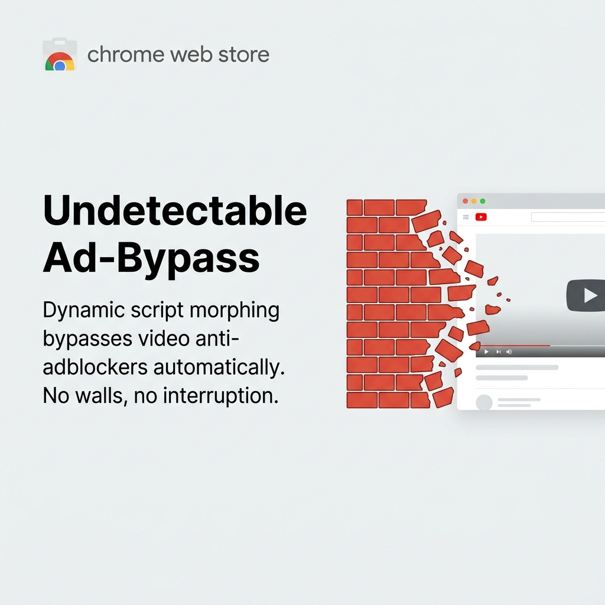
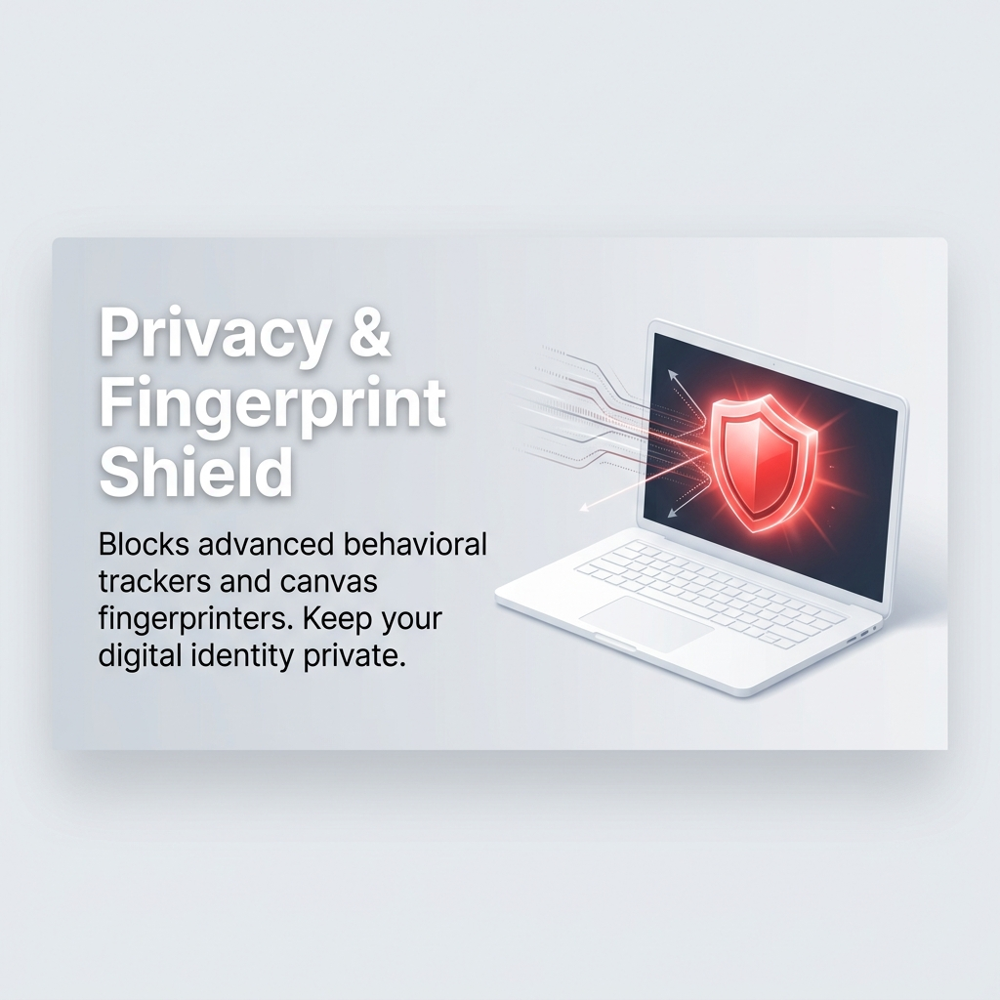
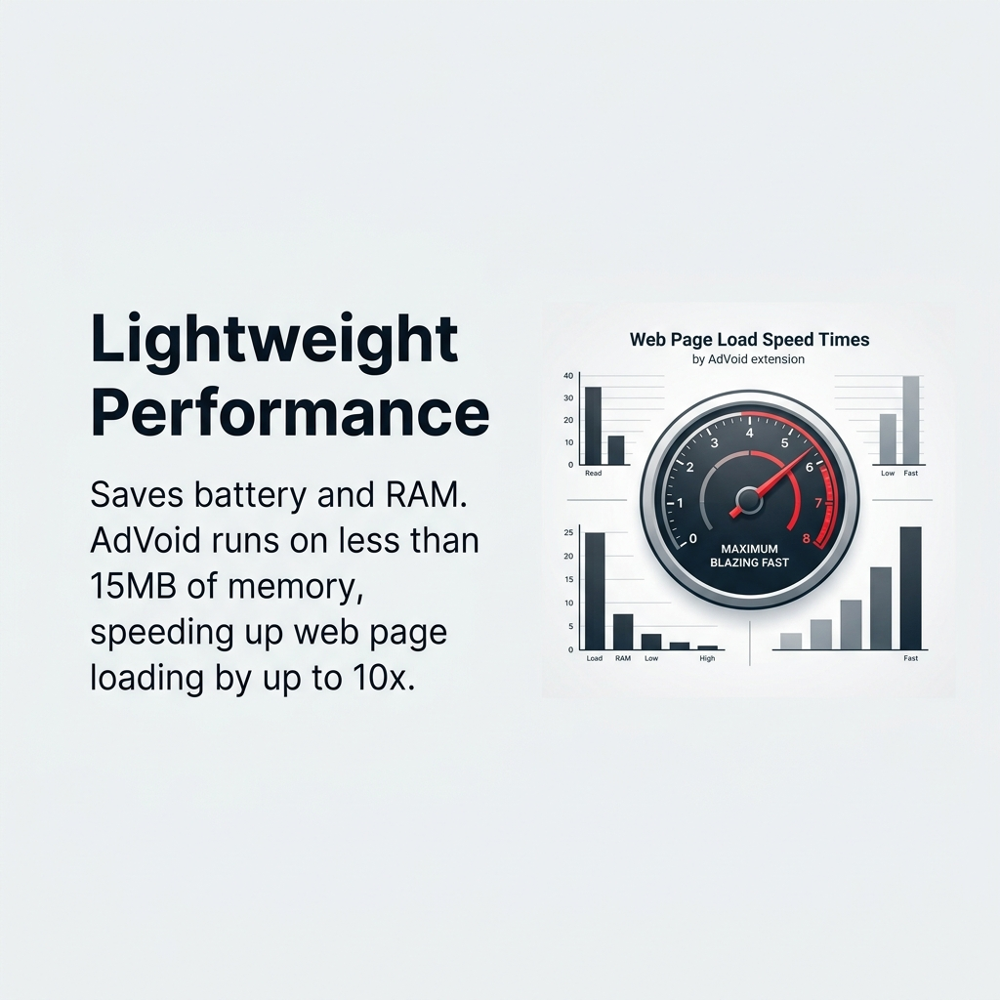

# AdVoid Chrome Web Store Promotional Slides

This document details the promotional slides for **AdVoid**'s Chrome Web Store listing.

> ⚠️ **Accuracy note:** Several messages in these slides (real-time AI heuristics, dynamic script morphing / anti-adblock bypass, fingerprint shield, WebAssembly, "10x faster", "<15MB") describe capabilities the current extension does **not** implement. AdVoid v1.0.1 blocks ads via static `declarativeNetRequest` rules plus DOM-based skip/hide logic. Chrome Web Store policy prohibits misleading listing content, so revise the copy to match actual behavior before publishing. See the repo root `README.md` for the real feature list.

---

## Promotional Slides

Listing images (currently **1024×1024** — the Web Store requires **1280×800** or **640×400**, so these must be resized/reframed before upload).

### Slide 1 — Master Banner

- **Purpose**: Brand introduction and primary CWS tile.
- **Key Message**: *AdVoid: The Next Generation of Ad Blocking. Powered by Real-Time AI.*

### Slide 2 — Real-Time AI Heuristics

- **Purpose**: Pitching the modern tech edge.
- **Key Message**: *No heavy static blocklists. AdVoid uses local AI to inspect and block ad scripts dynamically before they execute.*

### Slide 3 — Undetectable Bypass

- **Purpose**: Solving the "anti-adblock block" problem.
- **Key Message**: *Dynamic script morphing bypasses video anti-adblockers automatically. No walls, no interruption.*

### Slide 4 — Privacy & Fingerprint Shield

- **Purpose**: Promoting next-level user security.
- **Key Message**: *Blocks advanced behavioral trackers and canvas fingerprinters. Keep your digital identity private.*

### Slide 5 — Lightweight Performance

- **Purpose**: Speed and resource saving pitch.
- **Key Message**: *Saves battery and RAM. AdVoid runs on less than 15MB of memory, speeding up web page loading by up to 10x.*

---

## Chrome Web Store Listing Content

### Store Title
> **AdVoid — Next-Gen AI Ad Blocker & Bypass**

### Single-Line Description
> **Void ads, bypass anti-adblock walls, and browse 10x faster using real-time AI heuristics. Silent. Undetectable.**

### Listing Description
```markdown
Welcome to the future of distraction-free browsing.

AdVoid is not just another ad blocker. Traditional ad blockers rely on massive, slow-loading static blocklists that modern websites easily detect and block. AdVoid changes the game by using lightweight, client-side AI heuristics to analyze, block, and bypass ads dynamically.

Why AdVoid is Better Than Legacy Blockers:
- 🚫 Intelligent Ad Blocking: Removes pop-ups, banners, video ads, and sponsored links without breaking page layouts.
- ⚡ AI-Powered Bypass: Bypasses video anti-adblock scripts in real-time using dynamic script shifting.
- 🚀 10x Speed Boost: Stops tracking scripts and ads from loading at the request level, saving bandwidth and memory.
- 🔒 Privacy Shield: Prevents advanced fingerprinting, behavioral tracking, and data collection.

Zero configuration needed. Install AdVoid today and experience a clean, fast, and silent web.
```
